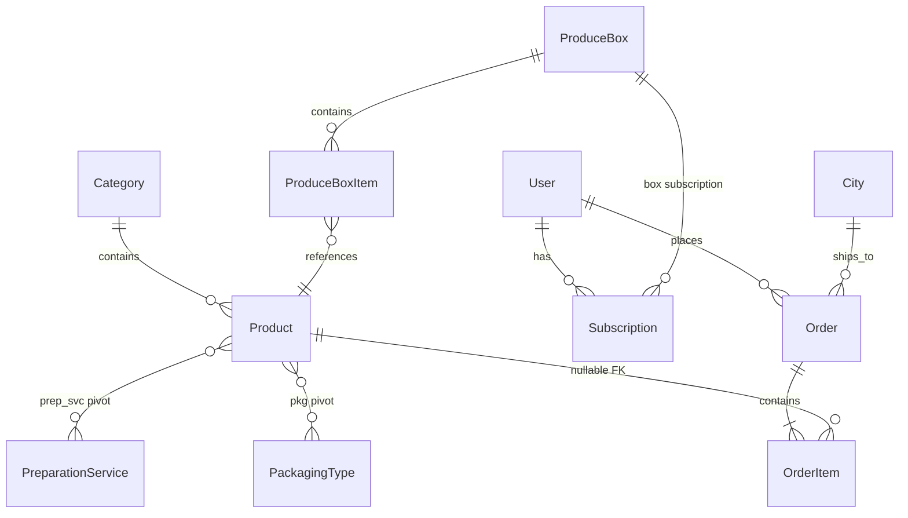

# AL-DAWY — Project Analysis

> **Purpose:** Single source of truth for developers and AI coding agents working on this repository.  
> **Brand:** AL-DAWY — fresh fruits & vegetables e-commerce (Egypt-focused, EGP currency).  
> **Composer package:** `aldawy/storefront`  
> **Related:** [PROJECT_GAPS_AND_ISSUES.md](./PROJECT_GAPS_AND_ISSUES.md) — missing features, flow improvements, bugs & roadmap

---

## 1. Executive summary

AL-DAWY is a **Laravel 13** monolith that powers:

| Surface | Path | Audience |
|---------|------|----------|
| **Public storefront** | `/`, `/shop`, `/cart`, `/checkout` | Customers (guest or logged-in) |
| **Admin panel** (Filament v5) | `/admin` | Staff (`users.is_admin = true`) |
| **Customer account** (Filament) | `/my` | Registered customers |
| **REST API** (Sanctum) | `/api/*` | Mobile / integrations (minimal today) |

**Core business:** Sell produce by **kg** (and optionally by piece), with optional **preparation services** (wash, peel, etc.) and **packaging types** that add fixed or percentage surcharges. Checkout uses **cash on delivery (COD)**. Orders trigger **PDF invoices**, **email**, and **SMS** (SMS currently logs only).

**Languages:** English (`en`) and Arabic (`ar`) via Spatie Translatable on models + `lang/{locale}/aldawy.php` + CMS content strings.

---

## 2. Technology stack

| Layer | Technology |
|-------|------------|
| Runtime | PHP **8.3+** |
| Framework | **Laravel 13** |
| Admin UI | **Filament 5.6** (two panels: admin + account) |
| Interactivity | **Livewire 4.3** (store components: search bar, price banner) |
| Frontend build | **Vite 7**, **Tailwind CSS 4**, **Alpine.js 3** |
| PDF | `barryvdh/laravel-dompdf` |
| Excel import/export | `maatwebsite/excel` |
| i18n (DB fields) | `spatie/laravel-translatable` |
| API auth | `laravel/sanctum` |
| DB (default in `.env.example`) | **PostgreSQL** |
| Cache (default) | **Redis** |
| Sessions | **Database** driver |
| Queues | **Database** connection |

---

## 3. Repository layout

```
fruits&veg/
├── app/
│   ├── Actions/           # Single-purpose command objects (orders, invoices, subscriptions)
│   ├── Console/Commands/  # Scheduled artisan commands
│   ├── Contracts/         # Payment + SMS interfaces
│   ├── DTO/               # Typed payloads (cart lines, order creation)
│   ├── Enums/             # OrderStatus, SubscriptionInterval
│   ├── Events/            # OrderCreated
│   ├── Exports/           # Maatwebsite Excel exports (admin)
│   ├── Filament/          # Admin panel resources, widgets, pages
│   ├── Filament/Account/  # Customer panel (my orders)
│   ├── Http/
│   │   ├── Controllers/   # Storefront, cart, checkout, auth, invoices
│   │   ├── Middleware/    # Locale, visitor tracking, Filament auth
│   │   └── Resources/     # API JSON transformers
│   ├── Imports/           # Excel imports
│   ├── Listeners/         # OrderCreated → invoice + notify
│   ├── Models/            # Eloquent models (17)
│   ├── Notifications/     # Mail notifications
│   ├── Payments/          # CashOnDeliveryGateway
│   ├── Providers/         # AppServiceProvider + Filament panels
│   ├── Services/          # Cart totals, pricing, money math, product price updates
│   ├── Sms/               # LogSmsSender (stub)
│   └── Support/           # StoreCart (session), Cms, StoreSeo, ProduceStockPhoto
├── bootstrap/app.php      # Middleware registration, routing
├── config/
│   ├── aldawy.php         # Currency, decimal scale, invoice sender name
│   └── analytics.php      # GA4 + Meta Pixel IDs
├── database/
│   ├── migrations/        # Schema (commerce + CMS + analytics)
│   └── seeders/           # Catalog, operations, banners, admin user
├── lang/en|ar/aldawy.php  # Storefront UI strings
├── resources/views/       # Blade: store, auth, pdf, filament overrides
├── routes/
│   ├── web.php            # Storefront + auth + signed invoice download
│   ├── api.php            # Sanctum user + orders
│   └── console.php        # Subscription scheduler
└── tests/                 # Feature + unit (cart, checkout, totals)
```

---

## 4. Architecture patterns

### 4.1 Layering convention

| Pattern | Where | Example |
|---------|-------|---------|
| **Action classes** | `app/Actions/*` | `CreateOrderAction`, `GenerateInvoicePdfAction` |
| **Services** | `app/Services/*` | `CalculateCartTotalService`, `SurchargeOnBase` |
| **DTOs** | `app/DTO/*` | `CreateOrderPayload`, `CartLineDto` |
| **Support (static helpers)** | `app/Support/*` | `StoreCart` (session cart), `Cms` |
| **Contracts + bindings** | `AppServiceProvider` | `PaymentGatewayInterface` → `CashOnDeliveryGateway` |
| **Domain events** | `OrderCreated` | Listener generates PDF, sends notifications |

### 4.2 Money handling

- All money uses **BCMath** via `App\Services\Money\DecimalMath` with scale from `config('aldawy.decimal_scale')` (default **4**).
- Prices stored as `decimal(14,4)` in DB.
- Currency label: `config('aldawy.currency')` → **EGP**.

### 4.3 Pricing formula (per cart line)

```
line_base       = unit_price × quantity (kg)
services_fee    = sum of preparation surcharges on line_base
after_services  = line_base + services_fee
packaging_fee   = packaging surcharge on after_services (if selected)
line_subtotal   = after_services + packaging_fee
```

Surcharges can be **fixed amount** or **percent of base** (`surcharge_is_percent` on `PreparationService` / `PackagingType`).

Order total:

```
order.subtotal     = Σ line totals (from CalculateCartTotalService)
order.packaging_fee = order-level packaging (often 0 in current checkout)
order.shipping_fee  = city.shipping_fee
order.total         = subtotal + packaging_fee + shipping_fee
```

### 4.4 Cart storage

- **Session key:** `aldawy_cart` (`StoreCart::SESSION_KEY`)
- Line shape: `{ product_id, kg, preparation_service_ids[], packaging_type_id? }`
- Lines merge when same product + same prep services + same packaging
- Resolution loads products with enabled prep/packaging pivots and computes surcharges

---

## 5. Domain model

### 5.1 Entity relationship (simplified)



### 5.2 Core tables

| Table | Role |
|-------|------|
| `categories` | Fruit/veg groupings; JSON `name`, `slug` (translatable) |
| `products` | SKU, `price_per_kg`, optional `price_per_piece`, images, `view_count` |
| `preparation_services` | Code, surcharge rules, sort order |
| `packaging_types` | Code, surcharge rules, sort order |
| `preparation_service_product` | Per-product enablement |
| `packaging_type_product` | Per-product enablement |
| `produce_boxes` | Curated box SKUs (subscription-ready) |
| `produce_box_items` | Box composition |
| `orders` | Reference `AL-XXXXXXXXXX`, customer info, fees, status, `invoice_path` |
| `order_items` | Snapshots: `product_name_snapshot`, unit, qty, services JSON, packaging code |
| `subscriptions` | Recurring box orders (`interval`, `next_order_at`) — **Phase 2 incomplete** |
| `cities` | Shipping zones + `shipping_fee` |
| `content_strings` | CMS key → en/ar values (cached forever) |
| `seo_settings` | Global + per-route meta, OG image |
| `home_banners` | Carousel slides |
| `site_visitors` | Session-based analytics (hashed IP/UA) |
| `site_page_views` | Per-path view log |
| `phone_verifications` | OTP storage (not fully wired in storefront auth yet) |

### 5.3 Order status lifecycle

`App\Enums\OrderStatus` (string-backed enum):

`pending` → `confirmed` → `processing` → `shipped` → `delivered` | `cancelled`

New orders start as **`pending`** in `CreateOrderAction`.

### 5.4 User roles

| Field | Meaning |
|-------|---------|
| `is_admin = true` | Can access `/admin` Filament panel |
| Any authenticated user | Can access `/my` account panel |
| Guest checkout | Allowed (`user_id` nullable on orders) |

Default seeded admin: `admin@aldawy.local` / `password` (see `DatabaseSeeder`).

---

## 6. HTTP routes & flows

### 6.1 Storefront (`routes/web.php`)

| Method | URI | Controller | Name |
|--------|-----|------------|------|
| GET | `/` | StorefrontController@home | store.home |
| GET | `/shop` | StorefrontController@shop | store.shop |
| GET | `/fruits` | StorefrontController@fruits | store.fruits |
| GET | `/vegetables` | StorefrontController@vegetables | store.vegetables |
| GET | `/products/{product}` | StorefrontController@product | store.product |
| GET | `/special-services` | StorefrontController@services | store.services |
| GET/POST | `/cart/*` | CartController | store.cart.* |
| POST | `/checkout` | CheckoutController@store | store.checkout.store |
| GET | `/checkout/thanks` | CheckoutController@thanks | store.checkout.thanks |
| GET/POST | `/login`, `/register` | Auth controllers | login, register |
| GET | `/invoices/{order}/download` | InvoiceDownloadController | invoices.download (signed URL) |

### 6.2 Checkout flow

```
Cart (session) → POST /checkout (validate city, address, phone)
  → CheckoutController builds OrderLineDraftDto[] from StoreCart::resolved()
  → CreateOrderAction (DB transaction)
  → PaymentGatewayInterface::handleCheckout (COD)
  → OrderCreated event
  → Listener: PDF + SMS + emails (customer + admins)
  → Clear cart → redirect thanks page (order id in session flash)
```

### 6.3 API (`routes/api.php`)

| Endpoint | Auth | Returns |
|----------|------|---------|
| `GET /api/user` | Sanctum | `UserResource` |
| `GET /api/orders` | Sanctum | Paginated `OrderResource` collection |

### 6.4 Middleware (global web stack)

| Middleware | Purpose |
|------------|---------|
| `SetLocaleFromQuery` | `?locale=en|ar` sets `app()->setLocale()` |
| `TrackSiteVisitor` | Upserts `site_visitors`, logs `site_page_views` (skips admin/api/assets) |

---

## 7. Filament admin (`/admin`)

**Provider:** `App\Providers\Filament\AdminPanelProvider`  
**Auth:** `FilamentAuthenticate` + `User::canAccessPanel()` requires `is_admin` for `admin` panel.

### 7.1 Resources (CRUD)

| Resource | Model | Notes |
|----------|-------|-------|
| `ProductResource` | Product | Translatable name/slug/desc, image upload, prep/packaging relations |
| `OrderResource` | Order | Status, items relation manager, exports |
| `CityResource` | City | Shipping fees |
| `PreparationServiceResource` | PreparationService | Surcharge rules |
| `PackagingTypeResource` | PackagingType | Surcharge rules |
| `UserResource` | User | Admin flag, order relation manager |
| `ContentStringResource` | ContentString | CMS overrides |
| `SeoSettingResource` | SeoSetting | Meta + OG image |
| `HomeBannerResource` | HomeBanner | Carousel |
| `SiteVisitorResource` | SiteVisitor | Read-only analytics |

### 7.2 Widgets (dashboard)

- `SalesOverviewStats`, `CommerceSnapshotWidget`
- `OrdersOverTimeChart`, `TopProductsByViewsChart`, `TopStorePathsChart`, `TrafficReferrersChart`
- `ActiveVisitorsWidget`

### 7.3 Excel import/export

Admin can import/export via Maatwebsite classes in `app/Imports/*` and `app/Exports/*` for: products, cities, orders, content strings, home banners, site visitors, page views.

### 7.4 Custom pages

- `AdminGuide` — in-app documentation for staff

---

## 8. Customer account panel (`/my`)

**Provider:** `App\Providers\Filament\AccountPanelProvider`  
**Path:** `/my`  
**Features:** Profile, `CustomerDashboard`, `MyOrderResource` (list/view own orders)  
**Auth:** Any logged-in user (no `is_admin` required).

Storefront login/register uses classic controllers (`LoginController`, `RegisterController`), not Filament login on account panel (`->login(null)`).

---

## 9. Key classes reference

### 9.1 Order creation

```
CheckoutController
  → CreateOrderPayload + OrderLineDraftDto[]
  → CreateOrderAction
      → CalculateCartTotalService (line math)
      → City lookup (shipping_fee)
      → Order + OrderItem records
      → PaymentGatewayInterface
      → OrderCreated::dispatch()
```

### 9.2 Post-order listener

`OnOrderCreatedGenerateInvoiceAndNotify`:

1. `GenerateInvoicePdfAction` → stores path on `orders.invoice_path`
2. Temporary signed URL (30 days) for download
3. SMS via `SmsSenderInterface` (currently `LogSmsSender`)
4. `OrderConfirmationNotification` to customer email
5. `AdminNewOrderNotification` to all `is_admin` users

### 9.3 Cart controller

`CartController` — add/update/remove/clear; supports AJAX JSON responses for add (see `CartAjaxAddTest`).

### 9.4 Subscriptions (incomplete)

- Model + migration exist
- `ProcessDueSubscriptionsAction` only **counts** due subscriptions (does not create orders yet)
- Scheduled: `aldawy:process-subscriptions` daily at 06:00 (`routes/console.php`)
- Comment in action: *"Phase 2: delegate to CreateOrderAction with box lines"*

### 9.5 Produce boxes

`ProduceBox` + `ProduceBoxItem` support bundled products. Storefront subscription/box checkout is **not fully implemented** in web routes; schema is ready.

---

## 10. Views & frontend

| Layout | Used by |
|--------|---------|
| `layouts/store.blade.php` | All storefront pages |
| `layouts/guest.blade.php` | Login/register |
| `partials/aldawy-theme.blade.php` | Tailwind theme tokens (brand green) |
| `partials/storefront-analytics.blade.php` | GA4 + Meta Pixel (env-gated) |

**Livewire/Volt-style components** (⚡ prefix):

- `components/store/⚡product-search-bar.blade.php`
- `components/store/⚡price-notice-banner.blade.php`

**PDF templates:** `resources/views/pdf/invoice.blade.php`, `catalog.blade.php`, `orders-summary.blade.php`

**View composer** (`AppServiceProvider`): injects `cartLineCount`, SEO meta, `cms()` helper into store views.

---

## 11. Localization & CMS

### 11.1 Locales

- Supported: `en`, `ar`
- Switch: query param `?locale=ar` (middleware) or links in UI
- Product/category names: JSON columns via Spatie `HasTranslations`

### 11.2 Translation sources (priority)

1. **CMS** — `ContentString` table, cached in `Cms::text($key, $fallback)`  
2. **Lang files** — `lang/{locale}/aldawy.php` (large storefront dictionary)  
3. **Filament** — uses Laravel `__()` for admin labels

### 11.3 SEO

`StoreSeo::pageMeta($routeName)` + per-route rows in `seo_settings`. Fallback titles/descriptions from lang keys in `AppServiceProvider` view composer.

---

## 12. Configuration reference

### 12.1 `config/aldawy.php`

| Key | Env | Default |
|-----|-----|---------|
| `invoice_sender_name` | `ALDAWY_INVOICE_SENDER_NAME` | abdelrahman mohamed |
| `currency` | `ALDAWY_CURRENCY` | EGP |
| `decimal_scale` | `ALDAWY_DECIMAL_SCALE` | 4 |

### 12.2 Important `.env` variables

```
APP_NAME, APP_URL, APP_LOCALE
DB_* (pgsql default)
SESSION_DRIVER=database
QUEUE_CONNECTION=database
CACHE_STORE=redis
MAIL_* (log driver in dev)
ALDAWY_* 
ANALYTICS_GA4_MEASUREMENT_ID
ANALYTICS_META_PIXEL_ID
```

---

## 13. Database & seeding

### 13.1 Migrations order (conceptual)

1. Laravel defaults (users, cache, jobs)
2. `2026_05_12_120000_create_aldawy_commerce_tables.php` — core commerce
3. Product images, content_strings, seo, visitors, view_count
4. Home banners, cities, shipping address on orders
5. Visitor insights + page views, banner image upload

### 13.2 Seeders

| Seeder | Purpose |
|--------|---------|
| `ProduceCatalogSeeder` | Categories + products from `database/seeders/Catalog/produce_items.php` |
| `CatalogOperationsSeeder` | Prep services, packaging types, pivots |
| `HomeBannerSeeder` | Sample banners |
| `DatabaseSeeder` | Calls above + creates admin user |

Run: `php artisan migrate --seed`

---

## 14. Testing

| Test | Covers |
|------|--------|
| `tests/Unit/CalculateCartTotalServiceTest.php` | Line + order total math |
| `tests/Feature/CartAjaxAddTest.php` | AJAX add to cart |
| `tests/Feature/CheckoutTest.php` | End-to-end checkout |

Run: `composer test` or `php artisan test`

---

## 15. Extensibility hooks (for implementers)

### 15.1 Add a payment gateway

1. Implement `App\Contracts\Payments\PaymentGatewayInterface`
2. Bind in `AppServiceProvider::register()`
3. Set `payment_gateway` identifier on orders (already stored)

### 15.2 Add real SMS

1. Implement `App\Contracts\Sms\SmsSenderInterface`
2. Replace `LogSmsSender` binding in `AppServiceProvider`

### 15.3 Complete subscriptions

1. Extend `ProcessDueSubscriptionsAction` to build `CreateOrderPayload` from `ProduceBox` lines
2. Advance `next_order_at` based on `SubscriptionInterval` enum
3. Wire storefront UI for box signup (routes TBD)

### 15.4 Sell by piece on storefront

- Model supports `sell_by_piece` + `price_per_piece`
- Current cart/checkout path uses **kg only** (`unit: 'kg'` in `CheckoutController`)

---

## 16. Security notes

- Invoice download uses **signed URLs** (`middleware('signed')`, 30-day expiry in listener)
- Visitor tracking stores **hashed** IP and user-agent (`sha256` + `app.key`)
- Admin panel gated by `is_admin` + Filament auth
- CSRF on all web POST routes
- Sanctum for API token auth

---

## 17. Operational commands

```bash
# Full local setup (composer script)
composer setup

# Dev stack (server + queue + logs + vite)
composer dev

# Process subscription cron manually
php artisan aldawy:process-subscriptions

# Code style
./vendor/bin/pint
```

---

## 18. Known gaps & technical debt

| Area | Status |
|------|--------|
| Subscriptions → auto orders | Schema only; action counts due rows, does not create orders |
| Produce box checkout | Not exposed on storefront |
| Piece-based cart | DB + model ready; cart uses kg only |
| Phone OTP auth | `phone_verifications` table exists; storefront uses email/password |
| SMS | Logs to Laravel log, no provider |
| Payment | COD only |
| API | Minimal (user + orders list) |
| README.md | Still default Laravel README (not project-specific) |

---

## 19. Conventions for AI agents

When modifying this codebase:

1. **Prefer existing patterns:** Actions for writes, Services for calculations, DTOs for structured input, Support for session/static helpers.
2. **Never use float for money** — use `DecimalMath` / `bc*` functions.
3. **Translatable fields** — use `getTranslation()` / `getTranslations()` on models with `HasTranslations`.
4. **Filament v5** — resources live under `app/Filament/Resources/{Entity}/` with separate `Schemas/`, `Tables/`, `Pages/`.
5. **Storefront strings** — add keys to both `lang/en/aldawy.php` and `lang/ar/aldawy.php`.
6. **Cart changes** — update `StoreCart`, `CartController`, and checkout draft mapping in `CheckoutController`.
7. **Order side effects** — hook into `OrderCreated` event, not inline in controller after create.
8. **Tests** — run `php artisan test` after cart/checkout/pricing changes.
9. **Minimal scope** — this is a focused commerce app; avoid introducing unrelated packages or patterns.

---

## 20. Quick file index

| Need to change… | Start here |
|-----------------|------------|
| Store homepage | `StorefrontController@home`, `resources/views/store/home.blade.php` |
| Product pricing rules | `SurchargeOnBase`, `StoreCart::resolved()` |
| Checkout validation | `CheckoutController@store` |
| Order persistence | `CreateOrderAction` |
| Invoice PDF | `GenerateInvoicePdfAction`, `resources/views/pdf/invoice.blade.php` |
| Admin product form | `app/Filament/Resources/Products/Schemas/ProductForm.php` |
| Routes | `routes/web.php`, `routes/api.php` |
| Scheduled jobs | `routes/console.php` |
| Service bindings | `app/Providers/AppServiceProvider.php` |
| Admin/customer panels | `AdminPanelProvider`, `AccountPanelProvider` |

---

*Document generated from codebase analysis. Update this file when adding major features (payments, subscriptions, piece-based cart, etc.).*
